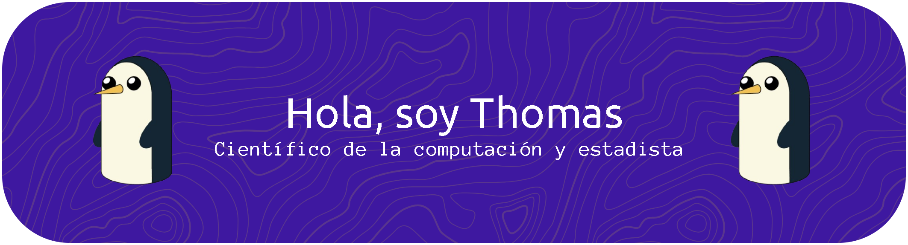

Estudiante de Ciencias de la Computación y Estadística |
Interes en bases de datos

## DATOS SOBRE MI:

- Estudiante de la Universidad Nacional de Colombia.
- Estoy aprendiendo herramientas como **Docker, UV** para programas desarrolados en Python.
- He empezado a crear mis primeras bases de datos tanto en *SUPABASE* como en *MYSQL*.

## Algunas herramientas

<!--
	
    
    
    
    
    
-->
